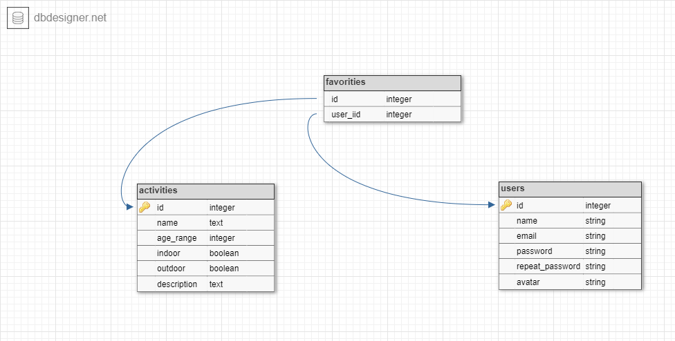

# Playdate

Playdate is an interactive catalogue that collects activities to do with children from 1 to 10 y.o.

*Why Playdate*

Parenthood it's a strange journey. It's easy to stumble in the guilt-loop of "not spending enough quality time" with your kids and at the same time beign too tired to come up with ideas of what to do together.

This is way I created Playdate: a platform where caregivers or educators can share their knowledge about activities, each entry contains a short description of the activity and the age group to which is addressed.

The activities can be filtered by keyword, each activity should have a title, the age to which is addressed and a short description.

*Future features* 

The more, the merrier! In the future Playdate will contain a feature to organize group activity, allowing a user to organise an activity or join one (and maybe have a quick chat before to the organizer!).

There is no real authentication, *yet*. Once it will be possible for real to log-in, each user will be able to add an activity to their favorites list, that will be shown in their profile.

There is already space for a **places catalogue** using this API of  **Open Data BCN** [Children spaces in Barcelona](https://opendata-ajuntament.barcelona.cat/data/en/dataset/culturailleure-espaisinfantils/resource/1d94653e-33a4-4ca2-94f6-83de6f3014fb)

## Tables of content

- Architecture
- Setup
- Notes

## Architecture

- Stack
- Database
- Endpoints
- FrontEnd

**Stack**

Playdate has been done using MySQL, Node.js/Express.js, React.js.

**Database**

Playdate database han a many to many structure. it has three tables: one to store the activities, one to store the user data and one that store the user_id and the activity_id.

**Endpoints**

| URL                	| HTTP Method 	| Description                                                        	| Request Object  	| Response Object                                                                                                                  	|
|--------------------	|-------------	|--------------------------------------------------------------------	|-----------------	|----------------------------------------------------------------------------------------------------------------------------------	|
| /activities        	| GET         	| Get all the activities in the catalogue                            	|                 	| [{"id": integer "title":string, "age": integer, "description": string} ]                                                   	|
| /activities?query= 	| GET         	| Get all the activities which description contains the keyword used 	| ?query=keyword  	| [{"id": integer, "title": string, "age": integer, "description":string} ]                                                  	|
| /activities        	| POST        	| Add an activity in the catalogue                                   	| req.params.body 	| [{"id": integer, "title": string, "age":integer, "description": string} ]                                                  	|
| /activities:id     	| DELETE      	| Delete the activity with the matching id                           	| req.params.body 	| { "message": "activity deleted!"}                                                                                                	|
| /activities:id     	| PUT         	| Update the activity with the matching id                           	| req.params.body 	| {"message": "activity updated"}                                                                                                  	|
| /users             	| GET         	| Get all the users                                                  	|                 	| [{"id":integer "avatar":string, "name":string,  "email":string, "password": string,  "repeat_password": string } ]    	|
| /users:id          	| GET         	| Get a specific user matching id                                    	| req.params.id   	| {"id": integer, "avatar": string, "name": string, "email": string, "password": string, "repeat_password": string} 	|
| /users             	| POST        	| To register an user                                                	| req.params.body 	| {"message": "user created"}                                                                                                      	|
| /users:id          	| PUT         	| Update the user profile                                            	| req.params.id   	| {"message": "profile updated"}                                                                                                   	|
| /users:id          	| DELETE      	| Delete the user profile                                            	| req.params.id   	| {"message": "profile deleted"}                                                                                                   	|
| /favorities        	| GET         	| List of activities favorite by a user                              	|                 	| [{"activity_id":integer, "user_id": integer} ]                                                                                  	|
| /favorities        	| POST        	| Add an activity to the favorities                                  	| req.params.body 	| {"message": "activity added to favorities"}                                                                                      	|
| /favorities:id     	| DELETE      	| Delete an activity from the favorities table                       	| req.params.id   	| {"message": "You no longer like this activity"}                                                                                  	|

There are also three guards to check if the provided id exsists.

**FrontEnd**

The following components are fully functional:

- Home
- Navbar
- Info (about section)
- Activities (activities section)
- Addform (form to add an activity)
- Searchform
- Places (underconstruction)
- Registration (registration form)
- Admin (admin dashboard)

While these needs to be completed adding authentication:

- User (user dashboard)
- Log in

## Setup

**Database preparation**

Create .env file in project directory and add

`DB_NAME: playdate`

`DB_PASSWORD: YOURPASSWORD`

(replace YOUR_PASSWORD with your actual password)

Type `mysql -u root -p` to access the MySQL CLI using your password.

In the MySQL CLI, type create database playdate; to create a database in MySQL.

Run the following in the MySQL CLI: ALTER USER 'root'@'localhost' IDENTIFIED WITH mysql_native_password BY 'YOUR_PASSWORD'; (replace YOUR_PASSWORD with your actual password)

Run `npm run migrate` in the project folder of this repository, in a new terminal window. This will create three tables: activities, users, favorities in your database.

Run:

 `USE playdate` 

 `SHOW TABLES`

  `SELECT * FROM TABLE_NAME`

 to see how is built each one.

### **Development**

Run `npm start` in project directory to start the Express server on port 5000.
In another terminal, do `cd client` and run `npm start` to start the client in development mode with hot reloading in port 3000.

**Libraries**

Playdate use Noty to display custom alert messages when some actions are perfomed, you may find the complete documentation [here](https://ned.im/noty/#/).

### Notes

*The activities displayed in the catalogue are modification of exsistent non-formal learning and Montessori activities you may find in:*

- Compasito manual on Human Rights Education for children
- My first Montessori: Montessori activities for children

### Credits

This is a student project that was created at [CodeOp](http://codeop.tech), a full stack development bootcamp in Barcelona._

